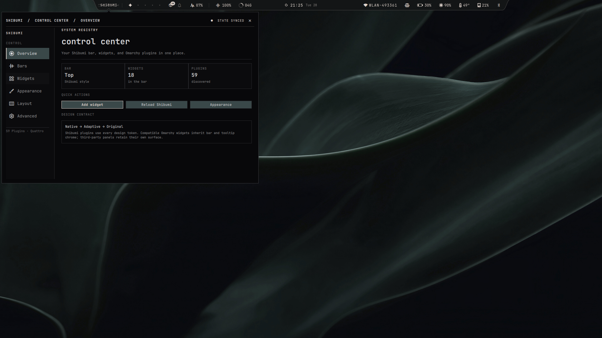
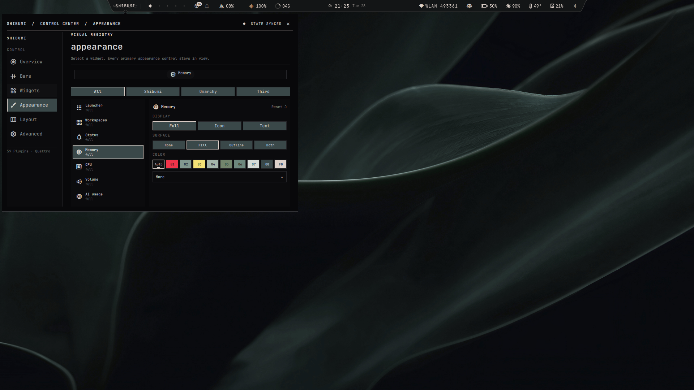

<div align="center">

# Shibumi Shell

**A native bar and plugin suite for Omarchy Quattro**

Shibumi brings the approved QS Rise V1 and V2 layouts, controls, widgets,
panels, and interaction model into Omarchy's existing shell process.

[Get started](docs/getting-started.md) ·
[Documentation](docs/README.md) ·
[Release status](docs/release-readiness.md)

</div>



## Install

> [!IMPORTANT]
> Version `0.1.0` is a private alpha. The command requires access to the private
> GitHub repository and an up-to-date Omarchy Quattro installation.

```bash
git clone git@github.com:HANCORE-linux/Shibumi-Shell.git && cd Shibumi-Shell && ./scripts/shibumi-suite install --yes
```

[Installation, updates, recovery, and removal](docs/install.md)

### Uninstall

Remove all managed Shibumi plugins and restore the stock Omarchy bar with
`./scripts/shibumi-suite uninstall`.

[Uninstall options and settings preservation](docs/install.md#uninstall)

<p align="center">
  
</p>

## Documentation

- [Get started](docs/getting-started.md)
- [Install, update, repair, or remove Shibumi](docs/install.md)
- [Configure the shell](docs/configuration.md)
- [Explore the plugin catalog](docs/plugins/README.md)
- [Troubleshoot a problem](docs/development/troubleshooting.md)
- [Understand the architecture](docs/architecture/overview.md)
- [Review current release readiness](docs/release-readiness.md)
- [Browse all documentation](docs/README.md)

[Contributing](CONTRIBUTING.md) · [Changelog](CHANGELOG.md) ·
[MIT License](LICENSE)
